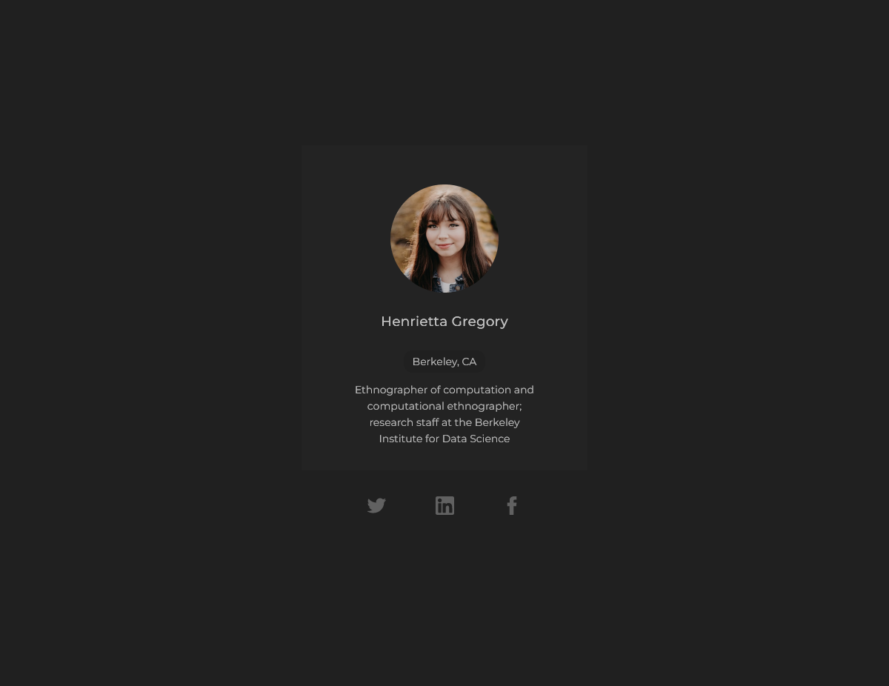
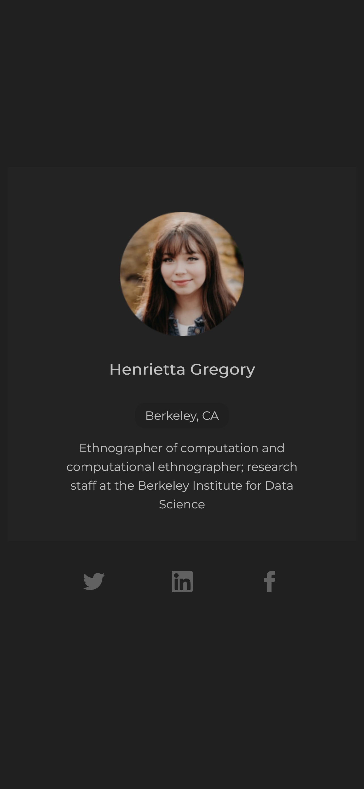

# 01-Profile-card - 100daysofprojects

[01-Profile-card] construido con HTML, CSS, para mejorar nuestras habilidades de codificación. Este proyecto es parte del desafío #100daysofprojects promovido por [Frontend Club](https://www.facebook.com/frontendclubfb).


### Tabla de contenidos

- [Descripcion](#descripcion)
  - [El desafio](#el-desafio)
  - [Capturas](#capturas)
- [Instalación](#instalación)
- [Contacto](#contacto)

## Descripcion

### El desafio

Codificar una **tarjeta de perfil personal**, usando HTML, CSS  y lograr que se parezca lo más posible al diseño.

Los usuarios deberían poder:

- Ver el diseño óptimo en pantallas grandes.
- Ver un color (`hover`) de fondo diferente al pasar el mouse sobre el ícono.

### Capturas

Capturas de pantalla en móvil y escritorio.




### Enlaces

Agrega los enlaces de la solución del proyecto y el repositorio.

- [Proyecto](https://01-profilecard.vercel.app/)
- [Repositorio](https://github.com/alejo9456/100daysofprojects/tree/main/01-profile-card)

## Flujo de trabajo

**Estructura del proyecto**

```txt
/
📂
├── 📂capturas/
├── 📂css/
│ └── style.css
├── 📂images/
└── index.html
└── README.md
```

**Tecnologías**

1. HTML Semántico
2. Estilos CSS
3. Animaciones CSS
4. Metodología BEM


## Instalacion

1. Clona el repositorio con ` git clonehttps://github.com/alejo9456/100daysofprojects.git`
2. Navega al directorio del proyecto: `cd 100daysofprojects/01-profile-card`
3. Abre el archivo HTML principal (index.html) en tu navegador web preferido.


## Contacto

Agrega los medios de contacto para que cualquiera pueda encontrarte y hablar sobre tus siguientes grandes proyectos.

- [LinkedIn](https://www.linkedin.com/in/alejandro-villanueva-fernandez/)
- [GitHub](https://github.com/alejo9456)
- [Fronten Mentor](https://www.frontendmentor.io/profile/alejo9456)
- [Portafolio](https://alejo-dev.vercel.app/)
---

> _La mejor manera de aprender a programar es practicando todos los días._ — **Frontend Club**
